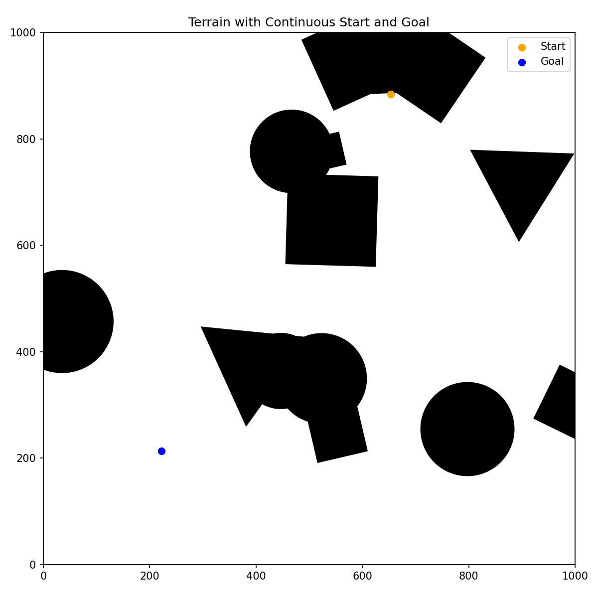
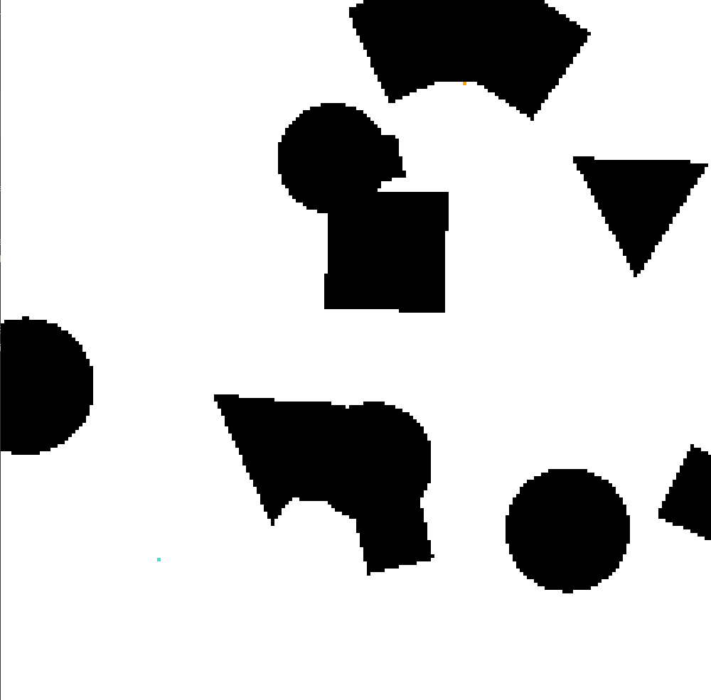
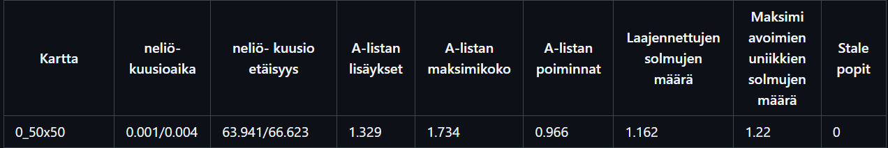

# Grid_topology_test

Tämä on kanditutkielman yhteydessä tuotettu koe, jossa neliö- ja kuusioverkkojen eroja testataan A*-polunetsinnän yhteydessä. astar_square ja astar_hex sisältävät algoritmit, joissa on omat heuristiikat, kaaren pituudet, jne. Visualizer on pygame-kirjastoa käyttävä GUI. Automoitujen testien aikana pygame ei piirrä mitään, jotta pygame ei vaikuta algoritmin suoritusnopeuteen.
## Kokeen rakenne
## Alkuperäiskartta
Koe aloitetaan luomalla joukko alkuperäiskarttoja, jotka edustavat maastoa, jossa polunetsintää halutaan suorittaa. Tämä vastaa kaupunkia, metsää, tai mitä tahansa muuta maastoa, jossa on selviä esteitä, joita pitää välttää matkalla maaliin. Luomme alkuperäiskartan käyttämällä shapely-kirjastoa. random_maps_generator.py-tiedostossa oleva config kertoo minkälaiset asetukset ovat käytössä. Projektissa on käytössä 4 eri esteprosenttia, 10%, 20%, 30% ja 40%. Alkuperäiskarttoja luodaan niin, että vektorigrafiikalla piirretyt esteet peittävät esteprosentin verran alkuperäiskartan pinta-alasta. Näiden karttojen luonti suoritetaan terrain_generator moduulilla. Kun alkuperäiskartta on luotu, aloitus- ja maalikoordinaatit lasketaan satunnaisesti.

Alkuperäiskartat löytyvät kansiosta plot_images.
## Neliö- ja kuusioverkkojen muodostus.
Kun alkuperäiskartta, ja aloitus- sekä maalikoordinaatit on valittu, muodostetaan 8 eri verkkoa niiden pohjalta. 50x50, 200x200, 500x500x ja 1000x1000 solmun edustus alkuperäiskartasta neliöillä ja kuusioilla. Verkot muodostetaan niin, että verkko asetetaan loogisesti alkuperäiskartan ylle. Mikäli solmun keskipiste on esteen päällä, niin solmu merkitään esteeksi. Seuraavaksi lasketaan aloitus- ja maalisolmun niin, että aiemmin laskettujen koordinaattien perusteella kaikista lähin avoin solmu merkitään aloitukseksi, ja maaliksi.

Tässä kuvassa on 200x200 solmun neliöverkko yllä olevasta alkuperäiskartasta.

## Testidata
test_all.py-skripti testaa jokaisen verkon jokaisessa kansiossa 0.1, 0.2, 0,3 ja 0.4. Jokaista tiheyttä kohden kirjoitetaan testidatan csv-tiedosto, test_0.10.csv, test_0.20.csv, jne. Testit ajetaan headless-tilassa, eli Visualizer-luokan draw-funktiota ei käytetä, jotta se ei vaikuta mitattuun aikaan. Ajastin käynnistetään, kun algoritmi alkaa, ja päättyy kun algoritmi palauttaa tuloksen. Algoritmit palauttavat seuraavat tiedot järjestyksessä: Suoritusaika, polun pituus(vakioliikkeissä), avoimen listan lisäykset, avoimen listan maksimikoko, avoimesta listasta noudettujen solmujen määrä, avattujen solmujen määrä, uniikkien solmujen maksimimäärä avoimessa listassa, stale popit.
1:Avoimen listan lisäykset: O(logn) lisäys avoimeen listaan. Kielii suoritusnopeudesta
2:Avoimen listan maksimikoko: Suurin määrä solmuja kerralla avoimessa listassa. Kielii algoritmin muistin tarpeista
3:Avoimesta listasta noudettujen solmujen määrä: A* vaatii sen, että avoimessa listassa olevien solmujen f-arvoja voi muuttaa. Pythonin PriorityQueue/heapq eivät sisällä mahdollisuutta muuttaa f-arvoa yhdessä avoimen listan elementissä. Siksi solmujen f-arvon muutos on implementoitu niin, että uusi versio pusketaan avoimeen listaan uutena solmuna. Closed-tietorakennetta käytetään, jotta yhtä solmua ei avata kahtaa kertaa.
4:Avattujen solmujen määrä: Yllä mainittu arvo - stale popit.
5:Uniikkien solmujen maksimimäärä avoimessa listassa: Oikeiden uniikkien solmujen maksimimäärä listassa.
6:Stale popit: Avoimen listan noudettujen solmujen määrä, joita ei avata, koska ne on jo suljettu.

2 ja 3 ovat suurempia kuin voisi olettaa, PriorityQueue'n rajoitusten takia. 4,5 ovat siis korjattuja versioita näistä. Jos nämä kartat ajettaisiin toisella koodikielellä, saadut arvot edustaisivat datapisteitä 4 ja 5.

## Md-tiedostot
md_generator.py lukee testidatan csv tiedostot, ja muodostaa jokaista tiheyttä kohden md-tiedoston, jonka voi lukea helposti.

Jokainen rivi md-tiedostossa edustaa yhtä neliö ja kuusioparia yhdestä solmumäärästä, tietystä alkuperäiskartassa. 

